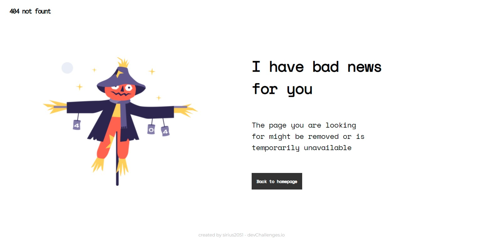

<h1 align="center">404 - Not Found</h1>

   Solution for a challenge from  <a href="http://devchallenges.io" target="_blank">Devchallenges.io</a>.

  <h3>
    <a href="http://404-not-found-sirius2051.vercel.app/" target="_blank">
      Demo
    </a>
     | 
    <a href="https://{your-url-to-the-solution}">
      Solution
    </a>
     | 
    <a href="https://devchallenges.io/challenges/wBunSb7FPrIepJZAg0sY" target="_blank">
      Challenge
    </a>
  </h3>

<!-- TABLE OF CONTENTS -->
## Table of Contents

- [Overview](#overview)
- [Features](#features)
- [Contact](#contact)

<!-- OVERVIEW -->

## Overview

- It was a fun experience playing around with CSS to complete the challenge.
- I can remember and practice more with HTML and CSS.

## Features

<!-- List the features of your application or follow the template. Don't share the figma file here :) -->

This site was created as a submission to a [DevChallenges](https://devchallenges.io/challenges) challenge. The [challenge](https://devchallenges.io/challenges/wBunSb7FPrIepJZAg0sY) was to build an application to complete the given user stories.

## Contact

- Website: [sirius2051.github.io](https://sirius2051.github.io)
- GitHub: [sirius2051](https://github.com/sirius2051)
- Twitter: [sirius2051](https://twitter.com/sirius2051)
